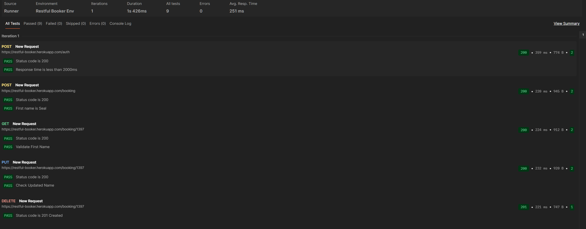

專案簡介
本專案針對 Restful Booker 訂房系統進行 API 自動化測試流程實作。測試重點在於模擬真實業務邏輯中的 API 鏈結 (API Chaining)，透過 Postman 環境變數實現資料在不同請求間的自動傳遞，取代手動輸入 ID 或 Token 的操作。

使用工具
工具： Postman Web

腳本語言： JavaScript (Postman Sandbox)

測試目標： RESTful API CRUD 邏輯與權限驗證

測試流程設計
測試腳本規劃為全自動化執行流程，利用環境變數串接各個請求：

[Auth] 取得權限： 執行登入請求，將回傳之 Token 自動存入變數 accessToken。

[Create] 新增訂單： 建立訂單資料，並自動擷取回傳的 bookingid。

[Read] 資料校驗： 帶入前一步生成的 ID 進行回查，驗證寫入資料的正確性。

[Update] 修改內容： 執行資料更新。此步驟包含權限驗證邏輯，需帶入正確 Cookie 格式。

[Delete] 清理資料： 測試完成後自動刪除該筆訂單，達成測試環境的資料清理 (Data Teardown)。

驗證重點
於 Post-response 腳本中定義以下檢核點：

狀態碼驗證： 檢查 200 OK 或 201 Created，確保 API 回應符合預期。

效能監控： 限制 Response Time 需在 2000ms 以內。

資料準確性： 使用 pm.expect 進行 JSON 內容比對，確保欄位資料傳輸正確。

異常排除與優化 
在腳本執行與測試過程中，針對出現的異常狀態進行了排查與修正：

403 Forbidden 權限格式修正： 經確認此 API 之 Cookie 認證格式要求嚴格，需精準設定為 Cookie: token={{accessToken}}。若缺少 token= 前綴字串，伺服器將無法識別身分並拒絕存取。此步驟強化了對不同 API 認證協議（Authentication Protocols）規範的理解。

標頭 (Headers) 的嚴謹性： 在 PUT 請求實作中，除了權限驗證外，需確保 Content-Type: application/json 正確設定。雖然現代測試工具（如 Postman）在特定設定下會自動處理，但為確保腳本在不同環境與框架下的穩定性，明確宣告標頭為必要實踐。

